# Chemical AutoEncoder
------
Comparing molecules from the chemical autoEncoder latent space and fingerprint plots
and its example

## setup
virtual conda environment with rdkit (environment.yml)

## Contents
- environment.yml : conda virtual environment
- models : AutoEncoder data
- chemvae : AutoEncoder model
  - hyperparameters : set hyperparameters
  - sampled_rnn_tf : rnn sample model
  - tgru_k2_gpu : gru sample model (importing rnn)
  - models : autoencoder sample model (importing gru)
  - mol_utils : utils to handle molecule format files
  - mol_callbacks : callback functions to be called
  - train_vae : implementing functions with actual model
  - vae_utils : utils to be used from VAE model

## Results

-----

#### 01. ASK1
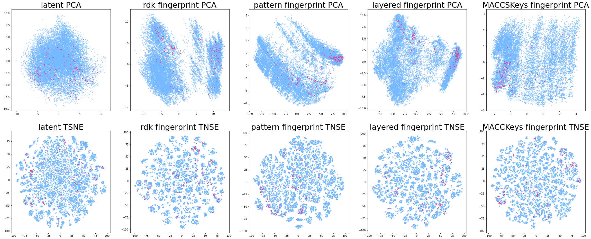

ASK1 kinase compound results with latent space and fingerprints; Red : Active compounds, Blue : Inactive compounds

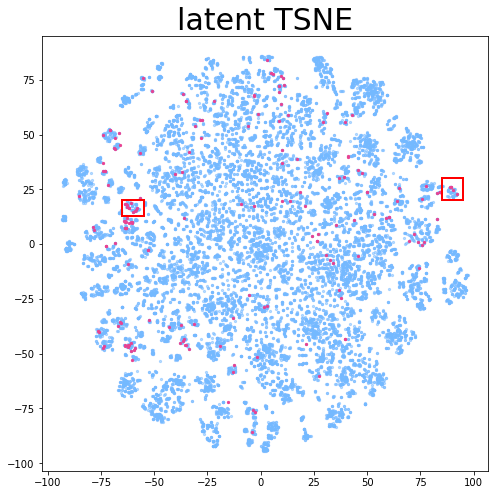

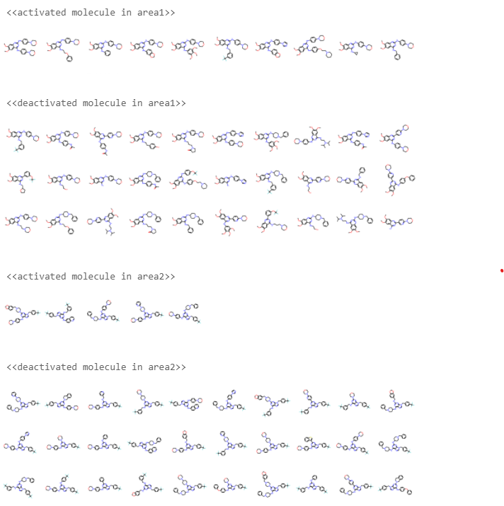

ASK1 kinase compound results with latent space and fingerprints

-----

#### 02. Mao (Asinex)
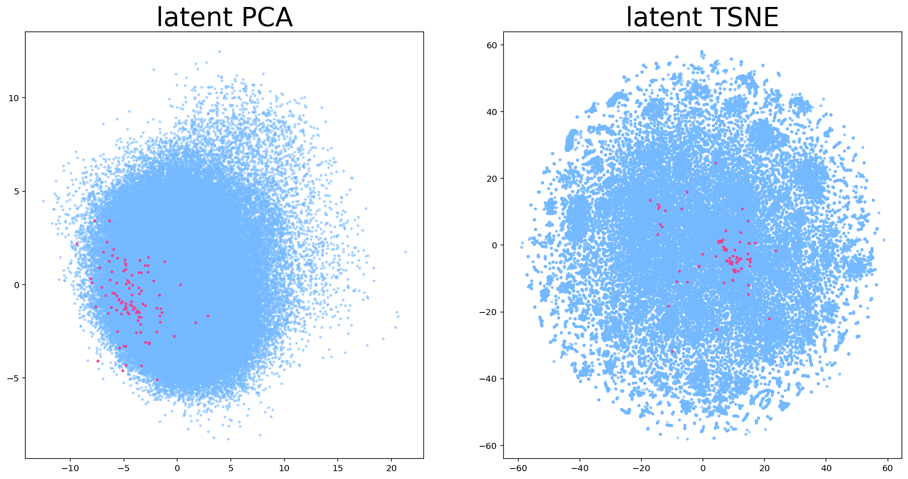

mao compound results with latent space; Red : Active compounds, Blue : Inactive compounds

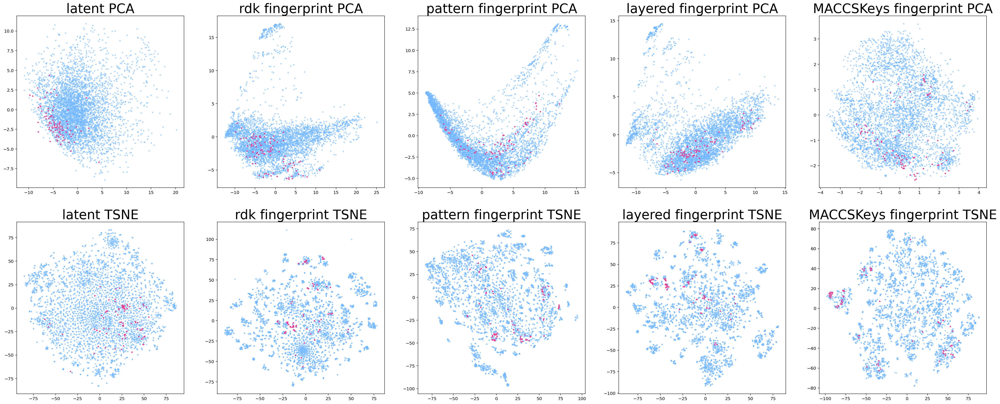

5000-batched mao compound results with latent space and fingerprint; Red : Active compounds, Blue : Inactive compounds

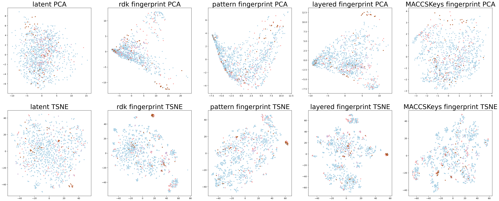

mao compound results with latent space and fingerprint; Bluish : activation 0, Purple : activation 1, Pink : activation 2, Brown : activation 3

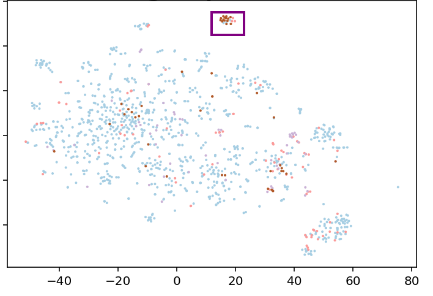

Subspace to check as the molecules are gathered

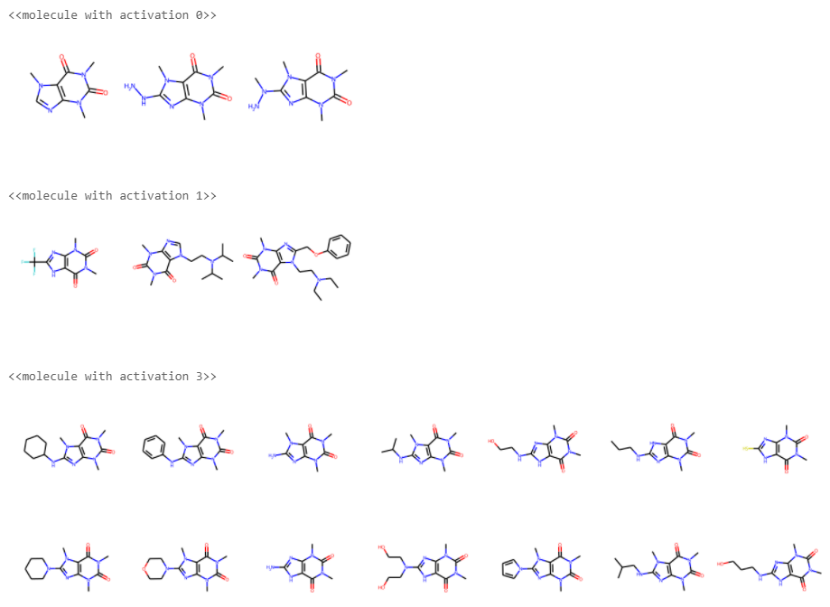

-----

#### 03. Aryl_ether
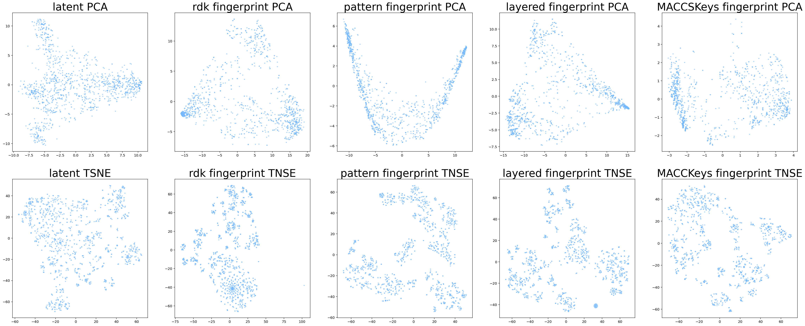

aryl ether compound results with latent space and fingerprint

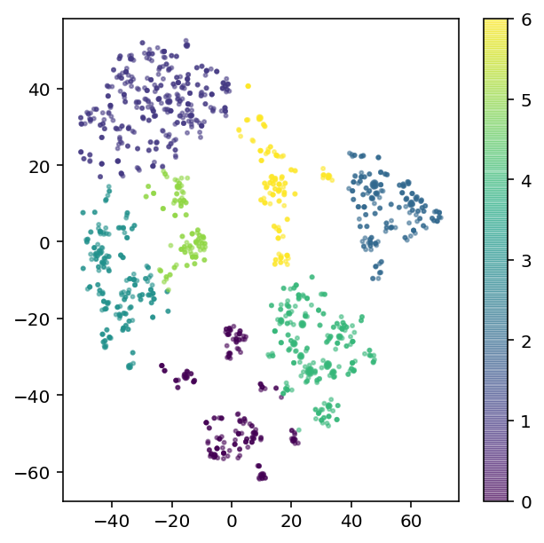

aryl ether compound clustered with 7 groups automatically

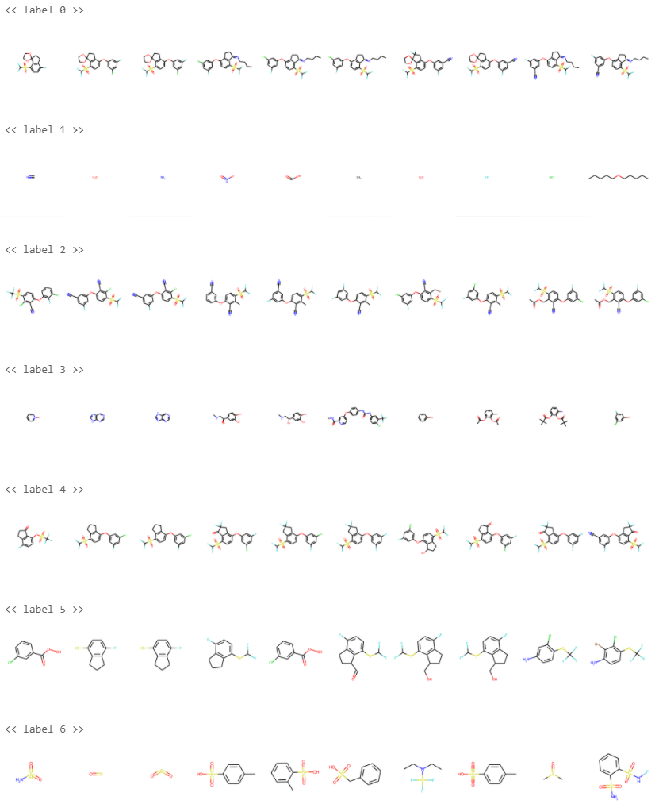

molecules of clustered 7 groups

→ we picked label 0, label 2, and label 4 for valid moleculs to research.

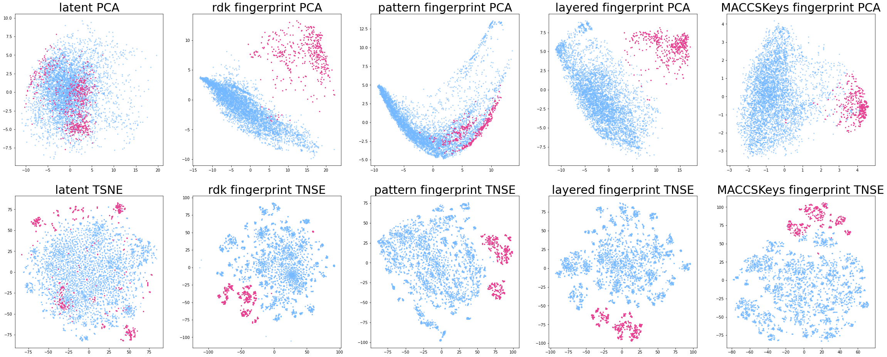

valid aryl ether results in batched asinex molecule groups with latent space and fingerprint; Bluish : asinex, Pink : aryl ether

## References
* Paper - [Automatic Chemical Design Using a Data-Driven Continuous Representation of Molecules](https://pubs.acs.org/doi/abs/10.1021/acscentsci.7b00572)
* Paper - [Improving Chemical Autoencoder Latent Space and Molecular DeNovo Generation Diversity with Heteroencoders](https://www.ncbi.nlm.nih.gov/pmc/articles/PMC6316879/)
* PubChem BioAssay (Database) - [AlphaScreen-based biochemical high throughput primary assay to identify inhibitors of apoptosis signal-regulating kinase 1 (ASK1)](https://pubchem.ncbi.nlm.nih.gov/bioassay/1159602)
* Assay - [Conditional generation via Bayesian optimization in latent space](http://krasserm.github.io/2018/04/07/latent-space-optimization/)
* Github Source - [Chemical Varitional Autoencoder - Aspuru guzik et al](https://github.com/aspuru-guzik-group/chemical_vae)
* Github Source - [Simpler Chemical Autoencoder - topazape](https://github.com/topazape/molecular-VAE)
* Github Source - [Molecular Autoencoder - HIPS](https://github.com/HIPS/molecule-autoencoder)