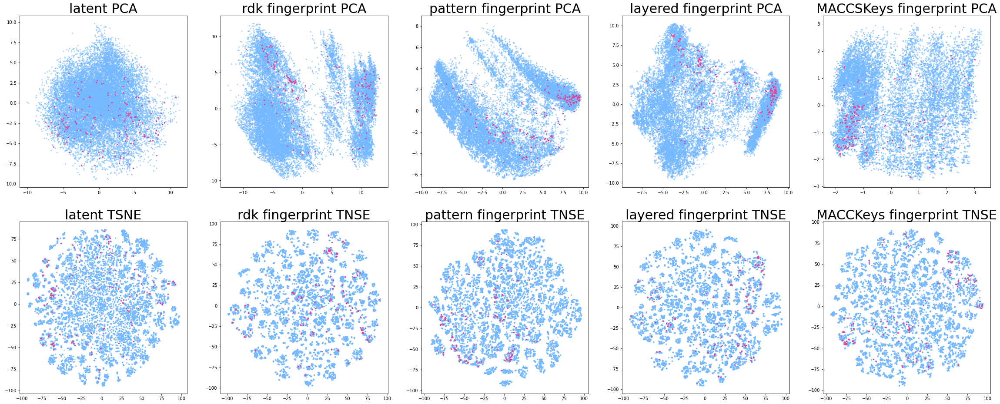

# Chemical AutoEncoder
------
Comparing ASK1 Activation from Chemical AutoEncoder latent space and fingerprint plots

(Red : Active compounds, Blue : Inactive compounds)
## setup
virtual conda environment with rdkit
(some samples contain the environment.)

## Contents
- environment.yml : conda virtual environment
- models : AutoEncoder data
- chemvae : AutoEncoder model
  - hyperparameters : set hyperparameters
  - sampled_rnn_tf : rnn sample model
  - tgru_k2_gpu : gru sample model (importing rnn)
  - models : autoencoder sample model (importing gru)
  - mol_utils : utils to handle molecule format files
  - mol_callbacks : callback functions to be called
  - train_vae : implementing functions with actual model
  - vae_utils : utils to be used from VAE model

## References
* Paper - [Automatic Chemical Design Using a Data-Driven Continuous Representation of Molecules](https://pubs.acs.org/doi/abs/10.1021/acscentsci.7b00572)
* Paper - [Improving Chemical Autoencoder Latent Space and Molecular DeNovo Generation Diversity with Heteroencoders](https://www.ncbi.nlm.nih.gov/pmc/articles/PMC6316879/)
* PubChem BioAssay (Database) - [AlphaScreen-based biochemical high throughput primary assay to identify inhibitors of apoptosis signal-regulating kinase 1 (ASK1)](https://pubchem.ncbi.nlm.nih.gov/bioassay/1159602)
* Assay - [Conditional generation via Bayesian optimization in latent space](http://krasserm.github.io/2018/04/07/latent-space-optimization/)
* Github Source - [Chemical Varitional Autoencoder - Aspuru guzik et al](https://github.com/aspuru-guzik-group/chemical_vae)
* Github Source - [Simpler Chemical Autoencoder - topazape](https://github.com/topazape/molecular-VAE)
* Github Source - [Molecular Autoencoder - HIPS](https://github.com/HIPS/molecule-autoencoder)